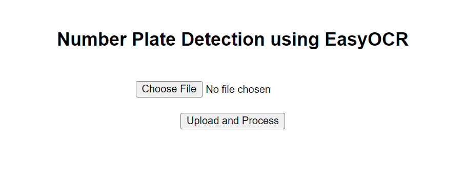

Here is your **final polished, clean, and professional README.md** for your **Number Plate Detection & OCR project**, formatted for **direct copy-paste** with all sections in a single frame for your GitHub repository:

---

````markdown
# 🚘 Number Plate Detection & OCR Recognition

This project performs **Number Plate Detection** using OpenCV Haar cascades and extracts text from detected plates using **EasyOCR**. It features a **Tkinter GUI** for image uploads, displays detected plates with their recognized numbers, and saves results to an Excel file.

---

## 📷 Demo



---

## 🛠️ Features

✅ Detects number plates from images  
✅ Recognizes plate text using EasyOCR  
✅ Identifies Indian state codes to infer country as **India**  
✅ GUI interface using **Tkinter**  
✅ Saves results to Excel (`output/number_plate_results.xlsx`), appending data each time

---

## 🔧 Requirements

Install dependencies with:

```bash
pip install opencv-python easyocr pandas matplotlib
````

*(Tkinter comes pre-installed with standard Python installations.)*

---

## 🚀 How to Run

1. **Clone the repository**

```bash
git clone https://github.com/yourusername/NumberPlateDetectionOCR.git
cd NumberPlateDetectionOCR
```

2. **Run the script**

```bash
python Number_Plate_Detections.py
```

3. The GUI window will open. Click **"Select Image"**, choose any vehicle image, and view results.

4. Detected number plates with country info will be:

* **Displayed in a window**
* **Appended to** `output/number_plate_results.xlsx`

---

## 📂 Project Structure

```
NumberPlateDetectionOCR/
├── input/
│   └── sample_plate.jpg
├── output/
│   └── number_plate_results.xlsx
├── Number_Plate_Detections.py
└── README.md
```

---

## ⚠️ Notes

* The detection uses Haar cascade (`haarcascade_russian_plate_number.xml`). Detection accuracy may vary for different countries and image quality.
* Extend the `indian_states` list in code for additional Indian state prefixes if needed.
* Ensure input images have **clear and visible number plates** for best results.
* EasyOCR supports multiple languages if configured accordingly.

---


